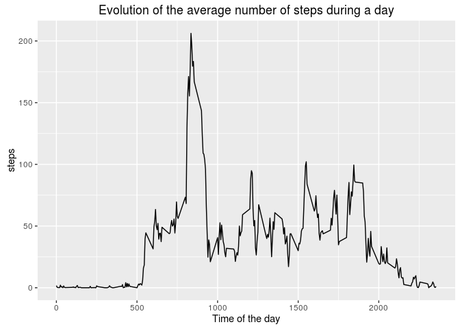

# Assignment week 2
Romain de Ganay  
26 octobre 2016  

## Introduction
This is the assignment of week 2 from the Coursera Course "Reproductible Research".  
We will be using the following packages from R:

```r
library(ggplot2)
library(dplyr)
```

```
## 
## Attaching package: 'dplyr'
```

```
## The following objects are masked from 'package:stats':
## 
##     filter, lag
```

```
## The following objects are masked from 'package:base':
## 
##     intersect, setdiff, setequal, union
```

## Data
The data for this assignment is located on this repository and is read into R:

```r
unzip("repdata%2Fdata%2Factivity.zip")
activity <- read.csv("activity.csv")
activity$date <- as.Date(activity$date, "%Y-%m-%d")
```
 The variables included in this dataset are:

* **steps**: Number of steps taking in a 5-minute interval (missing
    values are coded as `NA`)

* **date**: The date on which the measurement was taken in YYYY-MM-DD
    format

* **interval**: Identifier for the 5-minute interval in which
    measurement was taken

## What is the mean total number of steps taken per day?

```r
byday <- activity %>% select(steps, date) %>% group_by(date) %>% summarise_each(funs(sum))
hist(byday$steps, breaks = 8, xlab = "", main = "Total number of steps per day")
```

<!-- -->

```r
meanbyday <- mean(byday$steps, na.rm = TRUE)
medianbyday <- median(byday$steps, na.rm = TRUE)
```
  
The average number of steps by day is 1.0766189\times 10^{4} and the median number of steps by day is 10765. 

## What is the average daily activity pattern?

```r
activity_noNA <- subset(activity, !is.na(activity$steps))
byinterval <- activity_noNA %>% select(steps, interval) %>% group_by(interval) %>% summarise_each(funs(mean))
qplot(interval, steps, data = byinterval, geom = "line", xlab = "Time of the day", main = "Evolution of the average number of steps during a day")
```

<!-- -->

```r
maxTime <- subset(byinterval, steps == max(steps))[1,1]
```
  
The time of the day that contains the highest average number of steps is 835. It is likely to be travel to work. 

## Imputing missing value
Let us fill in the missing values with the average value of the corresponding 5 minute interval. 

```r
activity_clean <- activity
for(i in 1:nrow(activity_clean)) {
  if(is.na(activity_clean[i,1])){
    minutes <- activity_clean[i, 3]
    activity_clean[i, 1] <- subset(byinterval, interval==minutes)[1,2]
    }
  }
anyNA(activity_clean)
```

```
## [1] FALSE
```
  
We now make the same histogram as in previously, and determine again the average and median value for steps for each day. 

```r
byday_clean <- activity_clean %>% select(steps, date) %>% group_by(date) %>% summarise_each(funs(sum))
hist(byday_clean$steps, breaks = 8, xlab = "", main = "Total number of steps per day")
```

<!-- -->

```r
meanbyday <- mean(byday_clean$steps, na.rm = TRUE)
medianbyday <- median(byday_clean$steps, na.rm = TRUE)
```
  
The average number of steps by day is now 1.0766189\times 10^{4} and the median number of steps by day is 1.0766189\times 10^{4}. We see that the missing values did not really have an impact on these numbers. 
 

## Are there differences in activity patterns between weekdays and weekends?

```r
activity_clean <- activity_noNA
activity_clean$day <- weekdays(activity_clean$date)
activity_clean$day[activity_clean$day=="lundi"] <- "weekday"
activity_clean$day[activity_clean$day=="mardi"] <- "weekday"
activity_clean$day[activity_clean$day=="mercredi"] <- "weekday"
activity_clean$day[activity_clean$day=="jeudi"] <- "weekday"
activity_clean$day[activity_clean$day=="vendredi"] <- "weekday"
activity_clean$day[activity_clean$day=="samedi"] <- "weekend"
activity_clean$day[activity_clean$day=="dimanche"] <- "weekend"

byinterval <- activity_clean %>% select(steps, interval, day) %>% group_by(day, interval) %>% summarise_each(funs(mean))
qplot(interval, steps, data = byinterval, facets = day~., geom = "line")
```

<!-- -->
  
We can clearly see a difference. Weekends do not have the peak during the morning, waking up is later, and then the activity tends to be higher during the day. 


